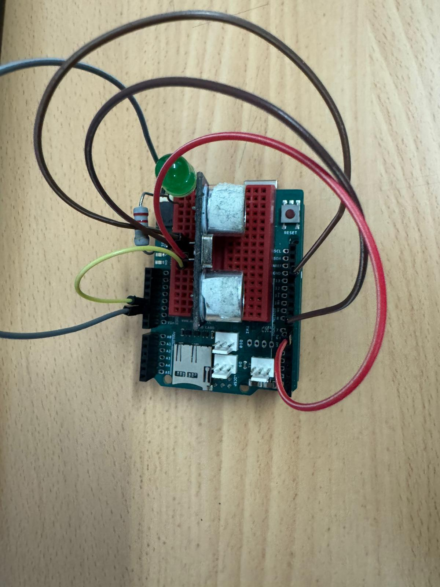
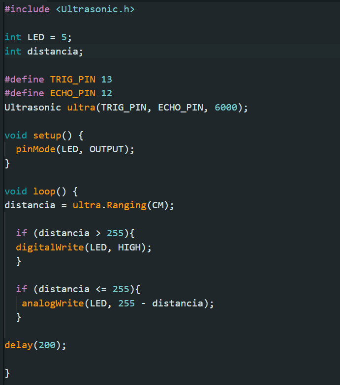
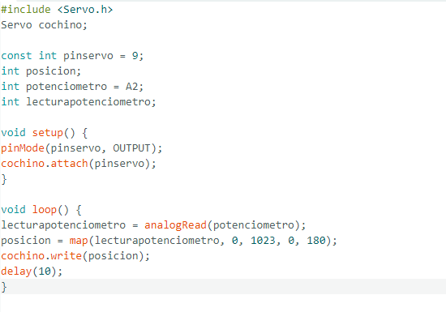

  # Pasos Previos - Realización de un doble intermitente.
## Introducción
El objeto de este primer proyecto, es comprender y recordar el funcionamiento y la programación de la placa de Arduino. Para esto hemso utilizado un único programas: Tinkercad. Ha sido para realizar la simulación del montaje, y a su vez, el programa. 

## Montaje 1
### Materiales
Para el montaje hemos necesitado los siguientes materiales: dos diodos led (de distinto color a poder ser), cables macho - macho, una resistencia como mínimo, una placa de prototipado donde colocar todos los materiales y la placa de Arduino donde van conectados todos los materiales.

Aquí se pueden ver todas las conexiones que han sido necesarias hacer. En este caso hemos optado por poner una única resistencia, lo que ha hecho que el montaje sea diferente al resto. Cada led tiene dos patas, la positiva y la negativa (ánodo y cátodo). Las positivas van a dos pines digitales de arduino distintos. Y las negativas están conectadas a tierra (GND). Finalmente la resistencia se puede conectar a cualquiera de las patas del diodo LED. En esta caso está conectado al negativo.

## Programación 
Para la programación de esta práctica, lo primero que tenemos que hacer es definir la variable tiempo, que van a ser los segundos que permanezcan encendidos los diodos LED. Una vez tenemos todas las variables definidas, que en este caso es tan sólo una, seguimos con el set up. El set up es una parte del programa que se ejecuta una única vez al iniciarse el programa. Aquí iniciamos el programa y además activamos los pines a los que los diodos están conectados. En el void loop, que se repite en bucle hasta que se termine el programa, hemos activado un pin de un diodo led y desactivado el otro. Y al réves después. Pero en el medio hemos puesto un pequeño delay que va a durar el tiempo que hayamos establecido al principio en la variable de tipo entera llamada tiempo. 

## Conclusión
Esta prueba nos ha permitido recordar las bases de la programación en Arduino, su sintaxis y además el control de un repositorio de Github. 

# Prueba 2 - Incorporación de un pulsador
## Introducción
Durante este trimestre, vamos a realizar una serie de pequeños proyectos o pruebas para poco a poco ir conociendo la interfaz de Arduino. En esta segunda prueba, hemos partido desde el montaje anterior y le hemos añadido un pulsador. De tal manera que al pulsarlo, se encienda uno de los dos ledes y al dejar de pulsarlo al contrario. 

## Montaje 2
### Materiales
Para este montaje hemos necesitado los mismos materiales que la práctica anterior. Sin embargo, le hemos añadido un pulsador y además ha sido necesario la incorporación de unos cuantos cables macho - hembra más.

Para el conexionado de todos los componentes hemos utilizado cables macho - hembra. Ademas hemos aprovechado el anterior montaje para a partir de este seguir con la incorporación del pulsador. Es por esto que lo único nuevo ha sido conectar el pulsador. Uno de los conectores del pulsador va unido al 5V, el otro al GND y, el último, a un pin digital.

## Programa 
Antes de nada, establecemos las variables de tipo entero, que en este caso son los dos ledes y el pulsador. A parte también tenemos que crear otra variable, la cual he llamado "estado pulsador" que indica si el pulsador está siendo pulsado o no, para posteriormente programarlo. En el void set up hemos establecido los ledes como dispositivos de salida y el pulsador como dispositivo de entrada e iniciamos el puerto serie. A continuación, en el void loop especificamos que la variable de estado pulsador es igual a la lectura digital del estado real del pulsador (pulsado, 1; no pulsado, 0). Si el estado del pulsador es 1, entonces el led 1 se enciende y el 2 se apaga. Y si el estado del pulsador es 0, entonces se hace a la inversa y además en el puerto serie, indica que el pulsador no está siendo pulsado (No pulsado). 

## Conclusión
Con esta práctica hemos ampliado nuestros conocimientos de la interfaz de Arduino, TinkerCad y hemos progresado en el control del lenguaje de código C++. 

# Prueba 3 - Potenciómetro y mapeo
## Introducción
Como todas las prácticas de este trimestre, partimos del anterior proyecto para ir aumentando nuestros conocimientos sobre la interfaz de Arduino y sobre algunos componentes tecnólogicos y su respectivo funcionamiento. El objetivo final de esta prueba es incorporar un potenciómetro al circuito de ledes para que así, la intensidad de los ledes o el LED vaya disminuendo o aumentado según gires el potenciómetro.

## Montaje
### Materiales
Para este circuito hemos necesitado los mismos materiales que antes: 
- Cables macho-macho.
- Un diodo LED.
- La placa de Arduino.
- Además de la reciente incorporación del potenciómetro.

### Programa

:writing_hand:	Al principio del programa lo primero que hacemos es establecer las variables como es ya de costumbre. Establecemos el pin del LED y el pin del potenciómetro, el cuál está conectado en un pin analógico; y además creamos la variable de lo que lee el potenciómetro y del valor que se guardará en el mapeado. 

:point_right:	Empezando con el void set up, ponemos al LED como dispositivo de salida y establecemos la comunicación con el puerto serie. Gracias a esta comunicación con el puerto serie vamos a poder ver los valores a tiempo real. :eye:	

:point_right:	En el void loop, lo primero que hacemos, es igualar la variable de la lectura del potenciómetro a lo que lee el potenciometro conectado al pin analógico. Después convertimos el valor de la salida del led con el mapeo, de tal manera que pasamos del rango (0 - 1023) al (0-255) que es el rango de la luminosidad del LED. Mas tarde, le decimos al LED que tome el valor de la salida LED, el cual hemos establecido antes gracias a la función del mapeo. De tal manera que cuando fuera 0 el led estará totalmente apagado y conforme se vaya acercando al 255 estará más iluminado. El programa podría acabarse aquí, sin embargo, hemos optado por añadir la lectura dek monitor serie también para así saber si está fallando el potenciómetro.

### Conclusión
Con este programa hemos aprendido cómo funciona el potenciómetro y cómo es su programación. Además hemos aprendido una nueva función de Arduino: el mapeo. Gracias a esta práctica hemos adquirido muchos conocimientos y hemos ampliado nuestras habilidades de programación de Arduino. 

# Prueba 4 - Ultrasonidos
## Introducción 
El propósito de esta práctica es conocer el conexionado de un sensor de ultrasonidos y cómo programarlo de tal manera que mida distancias y estas se muestren en el monitor serie.

## Montaje
El montaje de este programa es demasiado sencillo. Únicamente consta de un sensor de ultrasonidos conectado a una placa arduino. El conexionado es el siguiente:
1. VCC: va al 5V (proporciona la corriente)
2. TRIGGER: va a un pin digital (es lo que emite una señal)
3. ECHO: va a otro pin digital (es lo que recibe la señal)
4. GND: terminal tierra.

## Programa
El programa es muy sencillo ya que solo vamos a estar manipulando un único dispositivo. Para ello vamos a estar jugando con el monitor serie, que sería el lugar donde aparecerían las lecturas del sensor de ultrasonidos. Primero incluimos la librería del ultrasonidos. Después, como siempre, se establecen las variables que en este caso son el pin donde están conectados el TRIGGER y el ECHO del ultrasonidos; aprovechamos y establecemos que el sensor de ultrasonidos está compuestos por ese TRIGGER y ese ECHO. En el void set up lo único que hacemos es activar el puerto serie. Y en el void loop le decimos al puerto serie que mida la distancia en centímetros y que las muestre en el puerto serie. 

## Conclusión 
Con este programa, hemos recordado como utilizar el monitor serie. Esta practica nos ha ayudado a afianzar nuestros conocimientos sobre los sensores de ulrasonidos medidores de distancias, cosa que es muy útil ya que es muy relevante a la hora de hacer proyectos con Arduino.

# Prueba 5 - Control de luminosidad de ledes según distancia
## Introducción
El propósito de esta práctica es diseñar, montar y programar un sistema que permita hacer que dos diodos LED se iluminen más conforme cuanto más cerca esté un objeto al sistema diseñado.

## Montaje
El montaje de esta práctica consta de los siguientes materiales:
- Sensor de ultrasonidos medidor de distancia
- Diodo LED
- Resistencia
- Protoboard
- Cables macho - macho

## Programa
:point_right:	Antes de empezar, debemos tener instalada la librería de ultrasonidos. Después definimos todas las variables de tipo entero: en este caso establecemos en que pin está situado el LED y la variable de la distancia. También aclaramos en que pin está conectados el trigger y el echo del ultrasonidos, y que esos dos pines en conjunto que conforman el ultrasonidos. 

:point_right:	Lo único que hacemos en el void set up es establecer el diodo LED como dispositivo de salida.

:point_right:	En el void loop, lo primero que hacemos es decir que la variable distancia es la lectura del sensor de ultrasonidos en centímetros. Ahora empezamos con los condicionales: 
- El primero es que si la distancia es mayor que 255 entonces se enciende el led.
- El segundo es que si la distancia es menor o igual que 255 entonces ek led, según la distancia su brillo es mayor o menor. Esto lo hemos conseguido gracias a la operación matemática de 255 - distancia.

Al final del todo ponemos un delay para dejarle tiempo a la placa de procesar todo. 

## Conclusión
Con esta nueva práctica hemos desbloqueado más funciones del programa de Arduino como son los condicionales, y hemos aplicado nuevas operaciones matemáticas a parte de juntar todos los dispositivos de las otras prácticas, y programarlos en conjunto. El objetivo de esta prueba es que según vayamos moviendo el potenciómetro, gire el servomotor hacia un lado o hacia otro.

# Prueba 6 - Control de un servomotor con potenciómetro
## Introducción
En esta última prueba vamos a incorporar todo lo anteriormente aprendido. Vamos a combinar los conocimientos adquiridos sobre montaje y programación para esta prueba.

## Montaje 6
Para el montaje de esta prueba necesitaremos un potenciómetro y un servomotor. El montaje es muy sencillo al igual que todos los montajes de las pruebas anteriores.

### Servomotor
Como ya hemos aprendido el servomotor es un motor, como su propio nombre indica, que en su interior contiene una serie de ejes que hacen que se mueva. Hay varios tipos pero el que hemos utilizado funciona mediante posición. Hay algunos que solo se mueven hasta 90º y otros hasta 180º. En nuestro caso hemos utilizado el de 180º para tener más margen de giro.

### Potenciómetro
Es un dispositivo mediante el cual podemos variar la resistencia interna del propio dispositivo. Tiene dos pines comunes, y otro de control que es el que vamos modificando nosotros.

## Programación

:point_right: Antes de empezar a programar como tal, incluimos la variable del servo y utilizamos la variable Servo para nombrar al servo. Además le decimos que siempre va a estar en el pin 9, mediante una variable de tipo entera constante. Esto lo hacemos para que en el caso de cambiar de pin solo haya que hacerlo arriba del programa en donde está la variable en vez de ir revisándolo parte por parte. Hacemos lo mismo con el pin analógico del potenciómetro, y establecemos otras dos variables más: creamos la variable posición que nos va a indicar en qué posición está el servomotor y la de lectura del potenciómetro que nos va a indicar que valores va a ir tomando el potenciómetro. 

:point_right: En el set up establecemos que el servo es un dispositivo de salida, y establecemos que el servo está conectado en la variable pinservo (por lo tanto estará conectado en el pin que establezcamos al principio en la variable). 

:point_right: En el void loop, decimos que la lectura del potenciómetro equivale a la lectura analógica que tiene asociado el pin del potenciómetro. Además hacemos un mapeo mediante el cual convertimos los valores del potenciómetro en los del servo. Por lo tanto la variable posición del servo tomaría ese valor. Y ya por último, le decimos al servo que se ponga en la posición que diga la variable.

## Conclusión 
Mediante esta prueba hemos finalizado los pasos previos de Arduino. Hemos adquirido una serie de conocimientos básicos para el desarrollo de próximos proyectos más largos y complejos.

# Prueba 7 - Control de la posición de un servo con un sensor de ultrasonidos
## Objetivo
El objetivo de esta prueba es el de afianzar todos los conceptos necesarios para la posterior creación de un coche robot autónomo el cual sea capaz de recorrer un circuito sin chocarse. Para eso hemos necesitado jugar con la distancia y un servomotor.

## Montaje
Este montaje es muy sencillo ya que consta de muy pocos componentes, es decir, de un servomotor y un sensor de ultrasonidos que será lo que medirá la distancia. 

El sensor de ultrasonidos tiene 4 pines a los que hay que conectarlo: un GND, uno para la alimentación (5V), y un trigger que será el que proyecta las señales ultrasónicas y el echo que será el que las reciba. Estos últimos van conectados a pines digitales. Dependiendo del tiempo que tarde en recibir esas señales, calculará la distancia.

Por último, el servomotor hay que conectarlo a 3 pines: un GND, uno para la alimentación (5V), y otro a un pin digital el cual nos va a permitir tener el control de la posición del servo. 

## Programación

