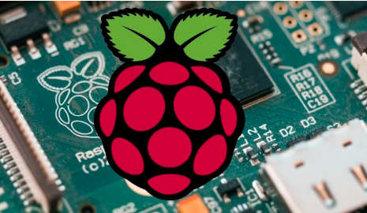

# Cuaderno de ingeniería curso 2025/26
 

¡Hola! Soy Eva, una Raspberry Pi con complejo de superordenador. A pesar de mi pequeño tamaño tengo mucha capacidad de almacenaje (o al menos la suficiente para guardar todos tus documentos en mi memoria). Me encanta conectarme con todos: ratones, teclados, luces… Pero sin duda mis favoritas son las impresoras. Tienen mucho que decir y me encanta leer todo lo que escriben. Y por último, en mi tiempo libre, cuando me aburro, me encanta darme un voltio por la red. ¡Hasta la próxima conexión!
